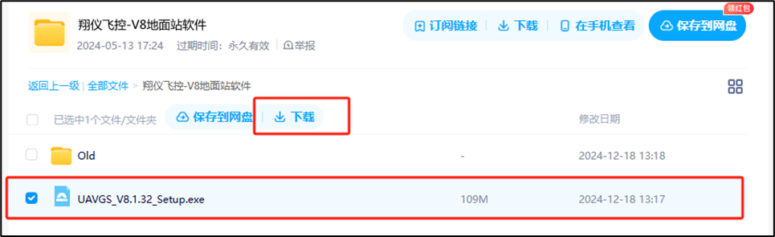
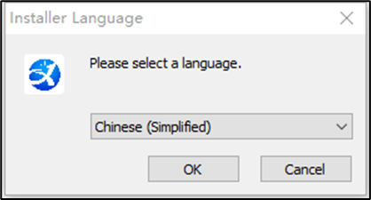
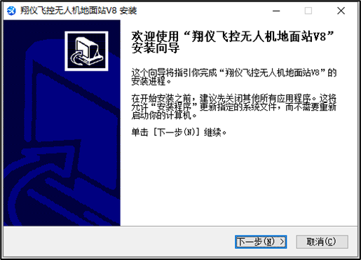
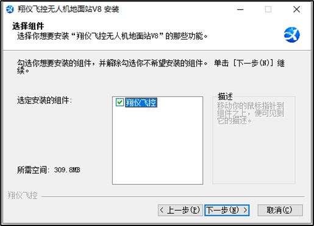
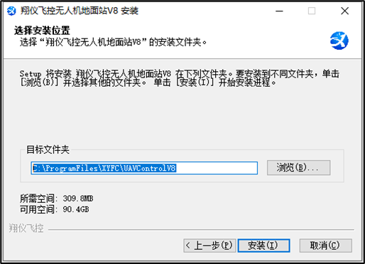
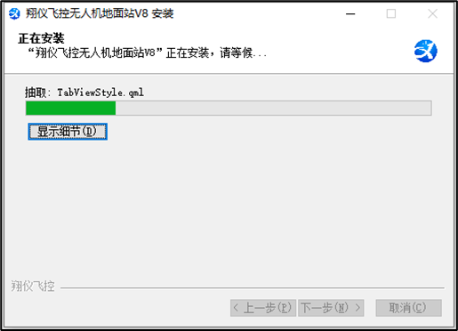
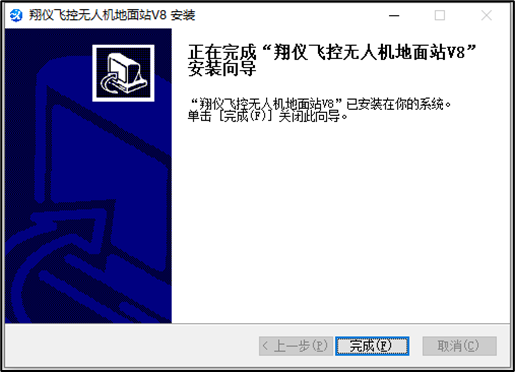
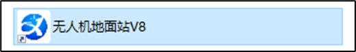
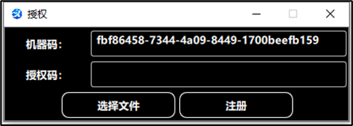

# 地面站软件下载与安装

## 地面站软件下载

以下为翔仪飞控-V8地面站软件安装下载的网盘地址：

链接：https://pan.baidu.com/s/1g3pWJekw0XcQQJtHLX9VuQ

提取码：7dxh

输入提取码打开后，请下载安装包文件至本地，下载时请耐心等候。

## 地面站软件安装与更新

运行步骤1中下载的软件安装包（UAVGS_V8.X.XX_Setup.exe），开始安装：

1.  根据使用习惯选择对应的安装界面使用语言，默认为“Chinese(Simplified)”简体中文，也可选择“English”英文进行使用，点击“OK”进行下一步。

    

2. 按照安装界面指引，建议关闭其他应用程序后，点击进行“下一步”操作。

3. 注意安装所需空间，安装位置剩余空间需满足此要求，点击进行“下一步”操作。

4. 选择合适的“目标文件夹”路径，确认可用空间大于所需空间，点击“安装”进行下一步操作。“_C:\\ProgramFiles\\XYFC\\UAVControlV8”_为默认安装路径。

5. 安装过程自动进行无需操作，可点击“显示细节”查看安装过程明细，进度完成后将自动跳转下一步操作。

6. 安装完后跳转至结束页，点击“完成”软件安装。

7. 软件安装完成后，会在桌面自动生成快捷方式，双击运行即可打开地面站软件。

**注意：**更新软件版本时，流程和上述相同，安装路径需与已有软件路径保持一致。

## 软件注册

双击桌面快捷方式即可运行V8地面站软件，首次打开软件，需注册后才能正常使用。

软件注册流程如下：

1.  全选并复制上方框内的机器码，联系并发送给翔仪商务人员进行授权码申请。
    - 通常在机器码框内Ctrl+A进行全选后复制。
    - 手动选择可能存在字符选择不全的情况，影响后续注册流程。
2.  翔仪商务人员会根据机器码进行授权申请，审批后反馈授权文件“机器码.lic”。
3.  在软件注册界面，点击“选择文件”选择上一步收到的软件授权文件，点击注册。
4.  若注册授权失败，请联系翔仪技术人员排查问题。注册授权成功后，会自动跳转进入软件主界面。

## 常见问题及排除

1.  无法打开安装包，提示“完整性问题”。
    - 安装包文件未下载完成，请重新下载并安装。
    - 电脑有病毒，破环了文件完整性，请查杀病毒后重新下载并安装。
2.  打开地面站软件后，无法找到串口号。
    - 检查串口线是否正确连接到电脑上。
    - 若连接了串口线，但仍然无串口号，请到电脑“设备管理器”中检查是否未成功安装串口线驱动。Win10/11系统可自动联网安装串口线驱动。
3.  尽量使用Win10及以上版本操作系统，由于Win7系统已经停止更新维护，V8地面站软件未针对Win7系统进行针对性适配，可能存在较多插件缺失问题。
4.  提示：常用的串口驱动在辅助资料链接中，下载链接如下：

链接：https://pan.baidu.com/s/1KVY_8oy7ztQMa4L8x33hMw

提取码：XYFC
