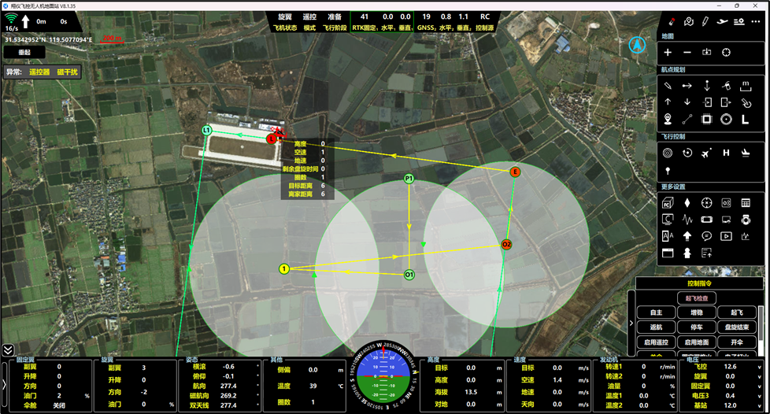

# 地面站软件功能介绍

地面站软件以地图为背景，功能显示区大致可分以下8个部分。

## 第一区域

图 11 第一区域

第一区域显示通信状态、静默开关、飞行距离、飞行时间、鼠标经纬度、地图比例尺、机型、异常、状态、指令收发等信息。

表 1第一区域显示说明

| -------- | :------: | ------------------------------------------------------------ |
| **图标** | **名称** | **功能说明**                                                 |
|          | 通信状态 | 正常通信时显示通信速率，表示通讯强度  无数据时显示断链时间  点击WiFi图标可进行通信接口的相关配置 |
|          | 上行静默 | 未开启上行静默时通信正常  开启上行静默时无上行数据     |
|          | 飞行距离 | 显示本架次累积飞行距离                                       |
|          | 飞行时间 | 显示本架次飞行时间                                           |
|          | 鼠标位置 | 显示鼠标当前位置的经纬度                                     |
|          |  比例尺  | 显示当前地图级别的比例尺                                     |
|          |   机型   | 显示地面站软件当前机型                                       |
|          | 异常状态 | 显示当前存在的异常内容                                       |
|          | 指令状态 | 显示当前指令的发送和执行情况                                 |

### 通信连接

图 12 建立通信连接

常用的连接方式有串口和UDP两种连接方式：

#### 串口连接

1.  打开，弹出通信配置界面（默认端口类型为串口）；
2.  在通信口配置界面中，从串口号列表里选择正确的串口号，选择完成后点击“打开”按钮，即可尝试建立与飞控的通信连接；
3.  飞控系统上电，等待数据接入。

**注意：**

若打开地面站软件后无法找到串口号，需要进行排查。首先检查串口线是否正确连接到电脑上；若已连接串口线但仍无串口号显示，需到电脑“设备管理器”中检查串口线驱动是否成功安装。对于Win10/11系统，可自动联网安装串口线驱动。

尽量使用Win10及以上版本操作系统，因为Win7系统已停止更新维护，V8地面站软件未针对Win7系统进行针对性适配，可能存在较多插件缺失问题，影响通信连接及软件其他功能的正常使用。

#### UDP连接

图 13 UDP通信连接

1.  打开软件的通信设置界面，端口类型选择“UDP”；
2.  在相应位置填写获取到的飞控设备目标IP地址和端口号，以及本地网络接口的 IP 地址和选定的端口号;
3.  完成参数配置后，点击“打开”按钮。

**注意：**

1.  确保该端口未被其他程序占用。
2.  若连接失败，检查网络参数是否正确、网络是否正常连通（如本地网络是否能ping通飞控设备的IP地址）、防火墙是否阻止了UDP通信等问题，针对问题进行调整后再次尝试连接。

### 数据共享

对于同时使用通用版本地面站和调试版本地面站的场景下，就需要使用数据共享功能，以下是对于数据共享时的操作使用：

1.  打开通用版本地面站，点击“”，弹出通信口界面，连接相对应的串口；

图 14 通用版本地面站串口打开

1.  打开共享界面（输入本地、远端的IP地址和端口，并“打开”；

图 15 通用版地面站共享功能

1.  打开调试版地面站，点击“”，弹出通信口配置界面，端口类型选择“UDP”，输入本地、远端的IP地址和端口，并“打开”，即可和通用版本地面站数据共享。

图 16 调试版本通信口配置

## 第二区域

第二区域显示当前的飞机状态、飞行模式、飞行阶段、卫星颗数、定位精度、控制源等信息。

图 17 第二区域

第二区域显示内容如表 2所示：

表 2 第二区域显示内容

|          |          |          |          |                          |                                    |        |
| -------- | -------- | -------- | -------- | ------------------------ | ---------------------------------- | ------ |
| 文字示意 | 固定翼   | 遥控     | 准备     | 28、24                   | 2.6、2.7；0.5、0.5                 | RC     |
| 含义     | 飞行状态 | 飞行模式 | 飞行阶段 | GNSS  （定位状态） | 水平、垂直精度  （定位精度） | 控制源 |

## 第三区域

第三区域显示地图工具、航点规划、飞行控制、任务规划、更多设置等功能。

### 地图工具

图 18 地图工具按钮

具备放大地图、缩小地图、缓存地图、飞机居中功能，如表 3所示：

表 3 地图工具

|          |          |                                            |
| -------- | -------- | ------------------------------------------ |
| **图标** | **名称** | **功能说明**                               |
|          | 放大地图 | 增加地图显示比例                           |
|          | 缩小地图 | 减小地图显示比例                           |
|          | 缓存地图 | 将选中地图区域保存至本地                   |
|          | 飞机居中 | 将地图视图以飞机当前所在位置为中心进行显示 |

#### 地图缓存

此功能用于在飞行时电脑无法联网情况下，提前将任务区域地图缓存。

点击“”，可打开地图缓存界面：

图 19 地图缓存

点击“选择区域”按钮后，在地图上通过鼠标左键单击，确定需要缓存区域左上角位置点后，移动鼠标可框选需要缓存区域地图，再次单击鼠标左键，确定框选区域右下角位置。

在“地图缓存”界面，可根据实际需求，选择地图的最大、最小级别，同时框选区域左上角和右下角位置的经纬度可在此界面进行调整。

框选完成后，可在信息缓存栏查看所框选区域缓存信息，点击“开始缓存”按钮，当下方进度条变为下载结束后，即表示完成缓存。

#### 飞机居中

点击“”，飞机位置便会自动归中，呈现在地图中央。

**注意：**使用此功能前，务必先确保飞机已完成定位。

### 航点规划

图 20 航点规划按钮

航点按钮名称和功能整理如表 4所示：

表 4航点规划相关功能说明

|          |          |                                                        |
| -------- | -------- | ------------------------------------------------------ |
| **图标** | **名称** | **功能**                                               |
|          | 绘制     | 在地图上添加绘制新的航点，左键单击绘制，右键退出       |
|          | 拖动     | 通过拖拽操作移动已存在的航点，左键按住拖动，右键退出   |
|          | 插入     | 在任意位置插入新的航点                                 |
|          | 清除     | 清除地图上的航点、轨迹、拍照点、兴趣点、兴趣线或盘旋点 |
|          | 测量     | 测量航线距离与角度                                     |
|          | 上传     | 将当前规划的航线上传至飞控                             |
|          | 下传     | 将机上航线下传至地面站软件                             |
|          | 导入     | 从本地文件导入航线或航点信息                           |
|          | 导出     | 将当前规划的航线导出为本地文件保存                     |
|          | 重绘起降 | 重新绘制起降航线                                       |
|          | OR       | 用于离线编辑，在当前地图中心生成起降航线               |
|          | 兴趣点   | 在地图上标记兴趣点                                     |
|          | 兴趣线   | 在地图上标记兴趣线                                     |
|          | 电子围栏 | 手动规划电子围栏区域，设置飞行边界                     |
|          | 备降航点 | 手动规划备用降落点                                     |

### 飞行控制

图 21 飞行控制按钮

涵盖圈数、盘旋点、直飞航点、高度调整、地速控制、飞行摇杆等功能，如表 5所示：

表 5 飞行控制相关功能说明

|      |          |                                    |
| ---- | -------- | ---------------------------------- |
| 图标 | 名称     | 功能说明                           |
|      | 圈数     | 设置飞机在巡航中重复飞行圈数       |
|      | 盘旋点   | 在地图设置盘旋点                   |
|      | 直飞航点 | 选择并设置直飞航点号，进行航点直飞 |
|      | 高度调整 | 进行高度调整（最大不超过200m）     |
|      | 地速控制 | 飞机进入地速控制                   |
|      | 飞行摇杆 | 地面站软件模拟飞行摇杆             |

#### 盘旋点

点击“”之后，鼠标在地图上单击，即可弹出“盘旋点设置”界面，如图所示：

图 22 盘旋点设置

飞机在巡航过程中，如需在特定的地方进行盘旋飞行，则输入特定的经纬度，以及盘旋时间、速度、高度及半径参数，上传即可，飞机会立即响应盘旋圈属性。参数含义如表 6所示：

表 6 盘旋点参数含义

|            |                                       |
| ---------- | ------------------------------------- |
| **名称**   | **参数含义**                          |
| 盘旋点类型 | 默认工作盘旋点                        |
| 盘旋模式   | 目标环绕、定点侦察                    |
| 盘旋方向   | 飞机盘旋飞行时的方向，即顺时针/逆时针 |
| 时间       | 盘旋时间                              |
| 速度       | 盘旋飞行时的空速                      |
| 高度       | 盘旋飞行时的高度                      |
| 半径       | 盘旋飞行时的半径                      |

#### 飞行摇杆

点击“”之后，弹出飞行摇杆界面，如图 23所示：

图 23 飞行摇杆

使用“飞行摇杆”功能前，需要勾选“启用摇杆”，操作方式和遥控器使用方法类似，即可通过该界面对应滑块功能操纵舵面进行动作。

**注意：**

1.  使用前，需要控制源在“GS”模式下；
2.  模式可通过地面站进行切换；

使用油门功能，则需要地面站双击“起飞”。

### 任务控制

图 24 任务控制

任务控制按钮名称和功能整理如表 7所示：

表 7 任务控制相关功能说明

|                                    |          |                                          |
| ---------------------------------- | -------- | ---------------------------------------- |
| 图标                               | 名称     | 功能                                     |
|                                    | 载荷摇杆 | 打开载荷控制界面，进行载荷相关操作与设置 |
|                                    | 拍照     | 单拍：拍摄一张照片                       |
| 连拍：连续拍摄多张照片             |          |                                          |
| 停止拍照：终止拍摄照片             |          |                                          |
|                                    | 相机模式 | 设置相机参数                             |
|                                    | POS点    | 下载POS点：下载机上POS数据               |
| 导入POS点：导入POS数据到地面站软件 |          |                                          |
| 清除POS点：清除机上POS点           |          |                                          |
| 查询POS点：查询机上POS点总数       |          |                                          |
| 删除导入：删除导入POS点数据        |          |                                          |
|                                    | 任务规划 | 进行任务规划                             |

#### 载荷摇杆

点击“”之后，弹出飞行摇杆界面，如图 25所示：

图 25 虚拟摇杆

需要与通道功能配合使用，即“输出通道-功能”，通道配置为相应的载荷摇杆功能，勾选“功能启用”之后，则表示该功能可使用，滑动滑块，对应的功能通道输出会相应变化。

**注意：**

使用该功能前，可与翔仪工程师联系沟通。

#### 相机模式

在地面站软件右上角“任务控制”栏中，找到并点击“”，打开“相机模式”界面，如图所示：

图 26 相机模式参数

根据实际需求，将相机模式修改为“等距”或者“等时”，并设置合适的拍照间距或拍照时间。一般来讲，巡检任务使用等时拍照即可，航测任务建议使用等距拍照才能保证重叠率。

快门保持时间需要根据相机设置，可以通过地面测试来确认设置的快门保持时间是否合适（防止漏拍、多拍）。相机有效电平根据实际相机需要设定。

参数含义如表 8所示：

表 8 相机模式参数说明

|                |                              |
| -------------- | ---------------------------- |
| **名称**       | **含义**                     |
| 等时/等距/停止 | 任务执行模式                 |
| 快门保持时间   | 输出控制信号保持时间         |
| 高电平有效     | 拍照时，输出控制信号为高电平 |
| 最小拍照间隔   | 相机最小拍照间隔（相机参数） |

### 更多设置

图 27 更多设置按钮

更多设置按钮名称和功能整理如表 9所示：

表 9 更多设置相关功能说明

|                              |          |                                                              |
| ---------------------------- | -------- | ------------------------------------------------------------ |
| **图标**                     | **名称** | **菜单包含功能设置界面**                                     |
|                              | 飞控配置 | 传输协议配置、查看飞控的版本、状态等关键信息                 |
|                              | 磁校准   | 执行磁罗盘校准功能                                           |
|                              | 电调校准 | 电调动力校准功能                                             |
|                              | 用户参数 | 安装向导、应急参数、油量保护、旋翼性能调优                   |
|                              | 动态数据 | 显示定制开发的遥测数据内容                                   |
|                              | 外部控制 | 特殊控制按钮编辑                                             |
|                              | 振动检测 | 显示飞机三轴的陀螺、加计实际测量值，实时姿态曲线             |
|                              | 摇杆配置 | 配置载荷摇杆                                                 |
|                              | 远程协助 | 通过输入用户名，请求技术支持人员进行远程协助                 |
|                              | 吊舱     | 配置吊舱相关参数                                             |
|                              | 参数备份 | 备份：保存当前飞行参数设置，以防数据丢失                     |
| 上传：将备份的参数上传至飞控 |          |                                                              |
|                              | 设备升级 | 执行飞控及其他模块的固件升级                                 |
|                              | 指令历史 | 记录并显示地面站的指令操作、飞行模式切换及异常提示等历史信息 |
|                              | 回放     | 回放已记录的飞行数据                                         |
|                              | 数据导出 | 导入飞行数据，导出飞行数据表格                               |
|                              | 命令窗口 | \---                                                         |
|                              | 用户设置 | 设置语音提醒、更换语言、地图类型、界面缩放、航线设置、定位精度、指令按钮、工具按钮、特殊功能等选择 |

#### 飞控配置

在地面站软件右上角“更多设置”栏目中，找到并点击“飞控配置”选项，打开“飞控配置”相关界面，如图 28所示：

图 28 飞控配置

1.  传输协议设置

进入“飞控配置-传输协议配置”界面。

在此界面的“传输速率”设置区域，可手动输入数值，以此调整飞控遥测下传的传输速率。

**注意：**手动输入的数值范围为0.1至20。

1.  飞控信息查询

在“飞控配置-飞控信息查询”选项，如图 29所示界面，在此界面，可查询飞控序列号、飞控主处理器及协处理器版本、飞行总架次、最新架次时间、飞行总时长、飞行总里程等信息。

图 29 飞控信息查询

1.  产品注册

在“飞控信息查询”界面中，点击“产品注册”按钮，在此界面，可查看飞控注册截至日期、注册功能等信息。如需进行飞控注册，点击此界面中后，选择对应的注册文件，再点击“注册”按钮，即可完成飞控注册流程。

#### 磁校准

打开地面站软件右上角“更多设置”界面，选择“磁校准”选项并打开。

图 30 磁校准

1.  在磁校准界面中点击“开始”，此时磁罗盘进入校准模式，磁状态变为橙色并显示“正在校准”，然后依次绕着飞机机体的三个轴（X、Y、Z）缓慢旋转360度。如果飞机机体比较大不方便旋转机体，可以将磁罗盘从机体取下，只转动磁罗盘进行校准。
2.  将飞机放下，在磁校准界面中点击“结束”，磁状态变为青色“校准结束未保存”，随后再点击“保存”，磁状态变为绿色“OK”，飞控退出磁罗盘校准模式，注意不要多次点击按钮，单击即可。
3.  再次依次获取四个方向的航向值，观察飞机四个方向的指向是否满足要求，如果满足要求，说明校准完成，重启飞控，继续从航向检查开始进行起飞检查，如果不满足要求则重新校准一次，方法同上。

#### 电调校准

按照以下步骤校准电调（RC校准）：

1.  飞控上电，此时电调不上电。（拆除无人机的旋翼桨，确保拆除过程中不损坏相关部件）；
2.  打开地面站软件-电调校准功能，如下图所示：

图 31 电调校准

1.  点击“旋翼”，使飞机模式切换到旋翼模式；
2.  点击“开始校准”；
3.  遥控器油门推至最大，电调上电，听到电调校准声音之后，拉至最低即可；
4.  校准完成后，点击“结束校准”退出校准模式。

#### 用户参数

图 32 用户参数

用户参数界面各参数说明如下：

表 10 用户参数界面各参数说明

|                                |                                      |                                              |
| ------------------------------ | ------------------------------------ | -------------------------------------------- |
| **栏目**                       | **名称**                             | **备注**                                     |
| **安装向导**                   | 磁偏角                               | 填写真实的磁偏角数值                         |
| 帮助                           | 根据输入的位置信息自动获取当地磁偏角 |                                              |
| **用户参数设置**               | 保护油门                             | 自主飞行时的最低油门，油动发动机的怠速油门值 |
| 爬升空速                       | 飞机爬升时的目标空速值               |                                              |
| 点火高度                       | 飞机自主模式下，自主点火的高度。     |                                              |
| 降落高度                       | \---                                 |                                              |
| 接地高度                       | \---                                 |                                              |
| **飞行参数调整**               | 转换高度                             | 飞机到达该高度开始转换                       |
| 转换速度                       | 飞机混合阶段的目标空速               |                                              |
| O1单次爬升高度                 | 飞机在O1盘旋时，单次爬升的最大高度   |                                              |
| 航线掉高高度                   | 自主模式下，掉高高度之后进入应急     |                                              |
| 点火持续时间                   | 油动发动机，点火持续时间             |                                              |
| 巡航保护高度                   | 自主航线飞行时，最低保护高度         |                                              |
| **应急参数**                   | 链路故障处理                         | 链路应急处理方式                             |
| 旋翼返航电压                   | 自主模式下，电压应急返航的最低阈值   |                                              |
| 旋翼降落电压                   | 自主模式下，电压应急降落的最低阈值   |                                              |
| 固定翼返航电压                 | 自主模式下，电压应急的最低阈值       |                                              |
| 返航油量                       | 自主模式下，油量应急的最低阈值       |                                              |
| **固定翼**  **性能调优** | 感度                                 | 各个方向的控制感度                           |
| 爬升率                         | 增稳、自主模式下最大爬升速度         |                                              |
| 下滑率                         | 增稳、自主模式下最大下降速度         |                                              |
| **旋翼**  **性能调优**   | 感度                                 | 各个方向的控制感度                           |
| 巡航油门                       | 增稳、自主飞行时的参考油门           |                                              |

#### 震动检查

将飞机放置在场外**等待定位正常**。检查飞机姿态变化正常后，打开“震动检查”界面。

图 33 震动检查界面

未启动动力，飞机水平保持静止时，三轴陀螺值应该保持在0°/s附近，X、Y轴加计保持在0g附近，Z轴加计保持在1g附近，姿态值保持在0°附近。

启动发动机后，分别在怠速、50%油门，100%油门状态下，观察飞控震动数据：

1.  上方为陀螺仪测量值，起伏范围不能超过±10°/s；
2.  中间为加速度计测量值，起伏范围不能超过±0.3g；
3.  下方为飞控姿态解算数据，起伏范围不能超过±2°。

如果上述震动检测中，陀螺仪测量数值或加速度计测量值有超出范围的，请注意改善减震情况。恶劣的震动环境会导致飞控无法有效控制飞机姿态，无法平稳飞行。

**改善减震情况可参考以下思路：**

1.  如果陀螺仪检测数据偏大，但加速度计测量值未超出范围，请适当增加减震球个数，或增加减震球硬度，减小飞控绕轴甩动的幅度。
2.  如果陀螺仪测量数据未超出范围，但是加速度计超出范围，请减少减震球的个数，或者使用较软的减震球，减小飞控沿轴平移的幅度。
3.  若加速度计测量值和陀螺仪测量值同时超出范围，请考虑更换到震动较小的安装位置，检查整理线束，避免外部其他设备、线束与飞控接触影响减震效果。

#### 远程协助

在测试、飞行过程中，若需进行远程协助，请按以下步骤操作：

首先，点击软件右上角的“更多设置”菜单，随后选择“”选项，即可打开“远程协助”界面，如图 34所示：

图 34 远程协助-1

在此界面中，输入正确的用户名后点击登录，当在线状态显示为绿色时，即登录成功，如图 35所示：

图 35 远程协助-2

若出现“用户名被占用”弹窗提示，请更改用户名后，按照上述步骤重新登陆。

#### 参数备份

地面站软件支持飞控参数备份、上传功能，可以在更多设置中打开参数备份界面，使用参数备份功能时，需要先给飞控上电，并保证通信正常。

1.  参数备份

点击“”，飞控会下传当前所有的飞行参数，等待进度条走完之后，会弹出文件命名界面，给文件命名之后即可将参数保存在电脑中。

图 36 备份参数

1.  参数上传

如有需要将飞控参数导入到其他同型号飞控（用于同型号飞机）中，可以将之前保存的参数上传到飞控里，不需要再次进行调参。

首先建立和新飞控的连接，点击“参数上传”，并选择上次保存的参数文件，状态框里会显示“下载参数完成”，点击“上传参数”，上传参数过程中请勿进行其他操作，避免通讯出错，待进度条完成后，状态栏会显示“参数校验通过，参数上传成功”字样，此时参数上传成功，需要给飞控重新上电，新参数才能生效。

如果提示参数上传失败或其他提示，请联系技术人员确认是否影响使用。

图 37 参数上传

#### 指令历史

在地面站软件右上角“更多设置”栏中，找到并点击“”，打开“指令历史”界面，如下：

图 38 指令历史

详细记录指令发送的时间和内容，方便用户追溯指令执行的时间顺序。设有“清除”按钮，用户可按需删除历史记录，避免记录过多导致界面繁杂。

#### 数据回放

打开地面站软件，在更多设置中选择打开“”菜单：

点击“打开文件”，选择地面站软件保存的飞行数据文件，飞行数据文件保存在地面站软件安装路径下。

图 39 数据回放

回放界面各参数、按钮含义从上至下、从左到右依次为：

1.  飞行数据名称（数据开始时间Rawdata.db）;
2.  数据开始时间、数据当前帧时间、数据结束时间（由飞行数据中的UTC时间转化而来的北京时间，若飞控未定位，则为时间无效）;
3.  进度条（可拖动、点选播放）;
4.  飞行状态显示（灰色-油门为0的时间段，红色-油门不为0的时间段，青色-飞行阶段变化）;
5.  “打开文件”按钮：打开飞行数据文件用于回放；
6.  减速播放、暂停/开始、加速播放、上一帧、下一帧、播放倍率；
7.  拖动时加载重要数据，拖动进度条时数据是否刷新。

#### 数据导出

地面站软件支持数据分析功能，在更多设置中点击“”按钮，打开“数据导出”界面，如下：

图 40 数据导出

1.  点击“打开文件”，选择要导出的数据文件，并打开；
2.  可将飞行数据导出成csv格式的表格用于详细的数据分析，或使用其他软件进行画图。

#### 用户设置

根据不同的使用场景可进行设置，主要有七个子单元合并而成通用设置、航线设置、语音播报、定位精度、指令按钮、工具按钮、特殊功能；

1.  通用设置

此界面用于调整显示地面站显示语言、地图源、地图类型、界面缩放倍率等信息，用户可根据实际使用需求进行调整。

图 41 用户设置_通用设置

1.  航线设置

此界面用于调整航线显示和高程数据路径相关的功能。

图 42 用户设置_航线设置

高程数据路径选择：点击文件夹图标，选择高程数据文件夹路径，然后点击保存，重启地面站软件。

经过此步骤，地面站软件将从该路径读取高程数据源文件。

1.  语音播报

地面站软件支持语音播报当前飞行状态信息，在更多设置中打开用户设置在“语音播报”栏进行配置，语音播报默认开启，“勾选”是否开启语音即可打开语音播报，点击语音配置打开配置选项菜单：

图 43 用户设置_语音播报

勾选相应选项后立即生效，即可完成语音配置。

**注意：**

某些电脑系统可能由于缺少组件导致无法使用语音报告功能，请检查电脑系统设置。

1.  定位精度

此界面参数保持默认即可。

图 44 用户设置_定位精度

1.  指令按钮

点击“指令按钮”按钮，打开设定菜单：

图 45 用户设置_指令按钮

可将上述常用的按钮，在地面站软件右下角“控制指令”栏显示出来，勾选需要显示的按钮后，立即生效。

1.  工具按钮

点击“工具按钮”，打开设定菜单。分为航点任务工具栏、飞行控制工具栏、更多设置工具栏。

图 46 用户设置_工具按钮 1

图 47 用户设置_工具按钮 2

图 48 用户设置_工具按钮 3

可将上述按钮进行勾选使用，勾选后立即显示在相应工具栏内。

#### 更新记录

在地面站软件右上角“更多设置”栏中，找到并点击“”，打开“远程协助”界面，如下：

图 49 更新日志

更新日志功能模块，主要用于向用户说明该版本相较于之前版本所做的改进与调整。如有问题，请及时联系翔仪技术人员。

## 第四区域

第四区域显示地图，地图源可根据需要选择天地图、必应地图、谷歌地图等。

## 第五区域

图 50第五区域

第五区域为飞行控制, ，此界面中的按钮可在用户设置中配置，以添加其他所需功能。

表 11常用飞行控制指令说明

|            |          |                    |
| ---------- | -------- | ------------------ |
| 按钮名称   | 交互方式 | 功能               |
| 起飞检查   | 单击打开 | 起飞检查窗口       |
| 自主       | 双击生效 | 切换到自主模式     |
| 增稳       | 双击生效 | 切换到增稳模式     |
| 起飞       | 双击生效 | 发送起飞指令       |
| 返航       | 双击生效 | 发送返航指令       |
| 停车       | 双击生效 | 关闭动力           |
| 盘旋结束   | 双击生效 | 结束盘旋           |
| 启用遥控   | 双击生效 | 控制源切为遥控器   |
| 启用地面   | 双击生效 | 控制源切为地面站   |
| 开伞       | 双击生效 | 打开伞舱           |
| 关伞       | 双击生效 | 关闭伞舱           |
| 固定翼熄火 | 双击生效 | 关闭固定翼部分动力 |
| 电子打火   | 双击生效 | 发动机启动指令     |
| 旋翼降落   | 双击生效 | 旋翼状态下就地降落 |
| 混合模式   | 双击生效 | 飞机模态切换指令   |

## 第六区域

第六区域为仪表盘，以飞行员视角显示飞机三维姿态和目标航向角（黄色标记），蓝色为天空，绿色为大地。如下图所示：

图 51 仪表盘

## 第七区域

图 52 舵量、姿态数据

图 53 RC、PWM数据

### 主界面栏

舵量、姿态、其他数据说明如下：

表 12 舵量、姿态、其他数据说明

|            |                                  |                            |
| ---------- | -------------------------------- | -------------------------- |
| 名称       | 内容                             | 备注                       |
| 固定翼舵量 | 副翼、升降、方向、油门、伞舱     | 数值为各个控制方向上的舵量 |
| 旋翼舵量   | 副翼、升降、方向、油门           |                            |
| 姿态       | 滚转、俯仰、航向、磁航向、双天线 | 均为飞机姿态信息           |
| 其他       | 侧偏                             | 航线飞行时偏离航线的距离   |
| 温度       | 飞控温度                         |                            |
| 圈数       | 自主飞行的剩余圈数               |                            |

### RC栏

遥控器的输入控制信号的数值，代表了遥控器各个通道的状态。

### PWM栏

飞控输出控制信号的数值，代表了各个通道的状态。

### 经纬度栏

代表飞机当前位置的经纬度。

## 第八区域

图 54 高度、速度数据

### 高度栏

表 13 高度栏数据说明

|      |              |                                        |
| ---- | ------------ | -------------------------------------- |
| 名称 | 含义         | 备注                                   |
| 目标 | 飞行目标高度 | 当高度锁定时有实际意义，绿色为锁定状态 |
| 高度 | 当前飞行高度 | 相对起飞点高度                         |
| 海拔 | 海拔高度     | 相对海平面高度                         |
| 对地 | 对地高度     | 相对地面的高度                         |

### 速度栏

表 14 速度栏数据说明

|      |                  |                        |
| ---- | ---------------- | ---------------------- |
| 名称 | 含义             | 备注                   |
| 目标 | 目标空速         | 增稳和自主模式下有意义 |
| 空速 | 飞机实时空速     | 默认为指示空速         |
| 地速 | 飞机实时水平地速 | 相对地面水平运动的速度 |
| 天向 | 垂直速度         | 飞机垂直运动的速度     |

### 动力栏

表 15 动力栏数据说明

|       |                              |
| ----- | ---------------------------- |
| 名称  | 含义                         |
| 转速  | 显示转速1测量值              |
| 转速2 | 显示转速2测量值              |
| 油量  | 显示油量测量值，需加装传感器 |
| 温度  | 显示温度测量值，需加装传感器 |

### 电压栏

表 16 电压栏数据说明

|       |                      |                          |
| ----- | -------------------- | ------------------------ |
| 名称  | 含义                 | 备注                     |
| 飞控  | 飞控供电电压的测量值 | \---                     |
| 电压1 | 电压测量1的测量值    | 不同硬件参考线序说明     |
| 电压2 | 电压测量2的测量值    |                          |
| 电压3 | 电压测量3的测量值    |                          |
| 基站  | 地面站供电电压       | 仅硬件包含地面基站时显示 |

# 航线规划说明

工作航点在地面站软件上显示有两种颜色，红颜色航点和黄颜色航点。黄颜色航点代表软件上规划的本地航点，可拖动和编辑，红颜色航点为从飞控上查询下来的航点，不能编辑。如果更改了本地航点，需要重新上传本地航点才能使机载端航点与本地航点同步。

## 航线、航点属性说明

在航线规划好之后点击“上传”按钮，弹出航线上传界面。

图 55 航点管理

1.  序号
    1.  P1为起飞引导点；
    2.  O1为起飞爬高盘旋点，1，2，3……等为工作航点序号；
    3.  O2为降高盘旋点，E为降落引导点，L为降落点；
    4.  L1、L2、L3为降落复飞航点。
2.  经度/纬度：表示航点的经纬度
3.  高度：航点飞行的高度（相对起飞点的高度）
4.  降落点/L点的高度：一般设置为用户调整界面“降落高度”参数默认70米，可根据实际工况进行设置。
5.  空速：表示飞机飞往该航点时的目标空速，需要大于等于参数中设置的“失速速度”，单位m/s。
6.  盘旋时间：用于设置勾选了“盘旋点“功能的航点盘旋时的盘旋时间，单位s。
7.  半径：飞机转弯时的转弯半径，需要大于等于参数中设置的“转弯半径”，单位m。
8.  拍照：勾选，表示从本航点开始拍照任务。不勾选，表示从本航点开始不执行拍照任务。
9.  盘旋点：用于设置工作航点是否为盘旋点，起降/复飞航点不支持修改是否盘旋。
10.  盘旋方向：用于设置勾选了“盘旋点“功能的航点盘旋时的盘旋方向，默认逆时针。
11.  高度控制模式：
     1.  独立控制：飞机的高度和位置独立控制，一边改变高度一边朝下一航点飞去；
     2.  高度优先：飞机会在上一航点处盘旋爬高，待高度到达后退出盘旋飞往该航点；
     3.  斜线控制：飞机将沿着2个航点在空间的连线进行运动，到下一个航点时位置、高度刚好到。
12.  本段距离：用户无需改动，软件会根据经纬度自动计算距上一点的距离，供用户参考。
13.  载荷俯仰/方位：保留设置，请勿更改。
14.  航点动作1~4：保留设置，请勿更改。